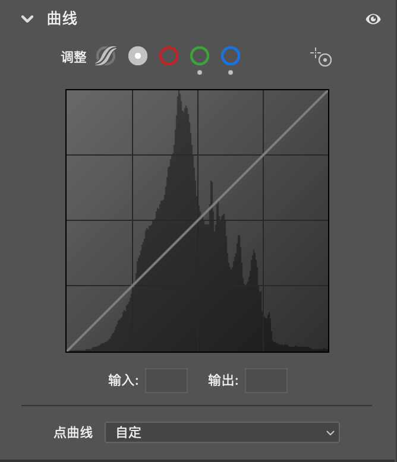

# PS-曲线
之前不是很理解曲线图的横纵坐标的含义，其实x轴表示不同颜色的值，而y轴表示不同颜色的亮度，如下图所示：

如果我想要调整提升暗部的亮度或降低亮部的亮度，那么我直接将曲线最左侧的点往上提，然后将曲线的右侧的点往下提，这样我图片的暗部就会被提亮，同时图片的两部被提暗。

如果我们想要调整某一个部位的亮度，那么就可以使用其中的定位点功能，将鼠标指向图片需要调整的地方，此时，就会在曲线上打上对应的点。此时我们就可以跳整图片中所有与这个亮度相同的所有亮度