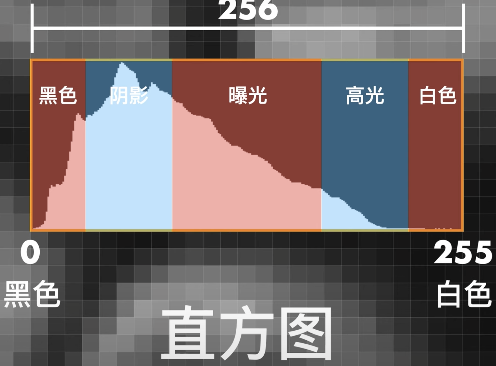
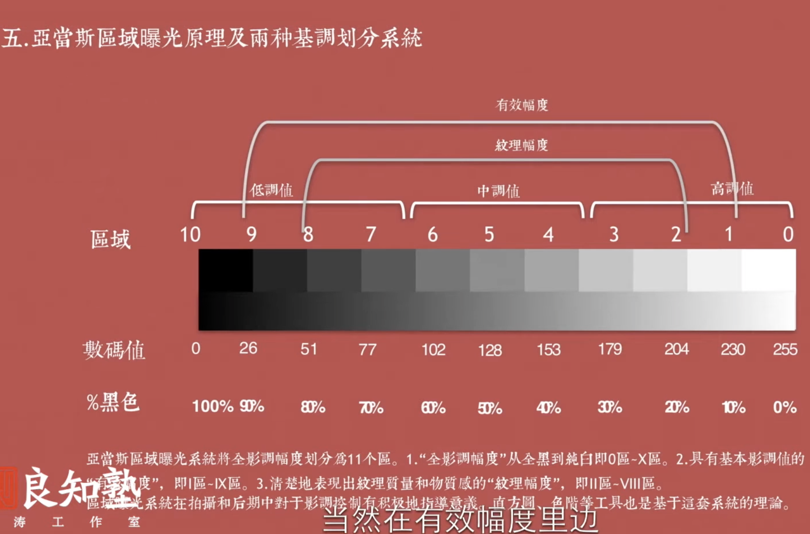
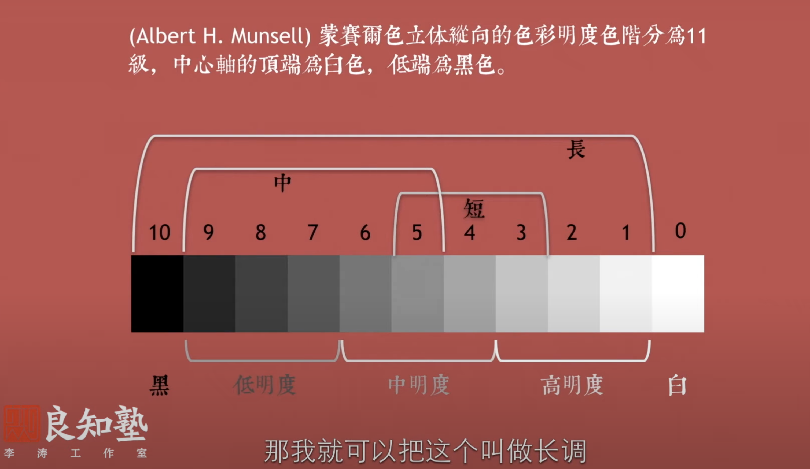

# 调色学习
## PS中各个部分的含义
### 1、直方图
直方图中分为10个部分，然后每两个部分就划分为一个影调，黑色、阴影、曝光、高光、白色。

也正是通过直方图将一张照片分为了5个部分，因此也就有了影调这一说法。影调是什么呢？我们可以看一下李涛老师关于影调的讲解[影调](https://www.youtube.com/watch?v=bthTXvgtC_w&ab_channel=%E6%9D%8E%E6%B6%9BPS)。
影调的作用
* 创造色彩，光影效果，构成影片色彩和黑白的基调。这句话有点抽象，就是就是你想让色彩的黑色和白色在照片的分布情况，一张照片的黑色和白色在直方图上采样上的多少问题，如果我们减少黑色，提高白色，照片的黑色的像素就会变少，白色的像素就会变多，但是这个时候其实也在调整
* 准确表现主题

影调的划分

我们将直方图中的中0～255划分成11个区域，每25个跨度范围划为一个区域。其中将上面的黑色和阴影划分为低调、中间的曝光划分为中调、然后高光和白色划分为高调值。
高调：包含照片中白色和高光部分的亮度信息
中调：包含照片中灰色部分的亮度信息
低调：包含照片中阴影和黑色部分的亮度信息

当我们在看一张照片的时候，我们去掉照片的色相和饱和度，我们只看一张照片的明度，能够得到一张照片的影调，这是我们分析一张照片风格的最基本的方法。如果我们无法看出一张照片的基本的影调，那也就谈不上模仿，也无法通过颜色来表达情绪。以前我总想的是通过构图来表达，构图只是完成了一张照片最基础的事情，颜色是可以表达情绪的，而且颜色本身就和情绪有关，我们要让观看的人能够一眼就觉得这张照片的颜色很舒服。

* 短调：使用直方图中任意3个连续的亮度信息。
* 中调：使用直方图中任意5个连续的亮度信息
* 长调：使用了整个直方图中所有亮度信息，

两种不同的方法，通过对亮度程度（高、中、低）和亮度范围跨度（长、中、短）的不同组合，可以得到九种不同的照片的风格

### 2、黑色

当我们调整PS中Cameraw的黑色滑块的时候，其实就是在调整照片的黑色部分，那么对于其他部分会不会产生影响呢？理论上来说应该不会

### 3、阴影
其实在黑色，每次听那些UP主调色的

### 4、高光

白色色阶主要影响的是直方图中的高光和阴影部分，

### 5、白色
黑色色阶段，主要影响的是直方图的暗部和中间调部分。

### 6、曲线

### 7、颜色分级

### 8、色调分离

## 仿色流程
大家在模仿
## 一、samalive 调色风格
### 1、构图

照片的人物处于居中的位置，人物处在透视消失点（网上说的一点透视）。其实人物出现在某个位置

### 2、时间

### 3、影调
按照李涛老师讲的影调划分，以内samalive的的照片即没有纯黑，也没有纯白，因此照片的两部信息主要集中在灰部，然后跨度也很长，大概跨越了10个亮度范围，所以应该属于长调，但是他的照片的风格是属于阴影和高光都很突出的，其实既不属于高调，也不属于中调，也不属于低调。所以我们就不需要来界定他的照片是属于高调、中调、低调的照片，我们只需要知道他的照片的明度分布就好了，我们找到照片中亮部信息，和暗部信息。

### 4、颜色
颜色这里主要看环境的颜色和人皮肤、头发、衣服、配饰的颜色。通过分析这些颜色的HSL，就可以模仿出这张照片的风格
